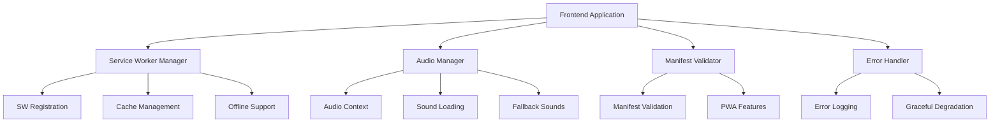

# Design Document

## Overview

This design addresses critical frontend deployment issues affecting the production application on Vercel. The solution focuses on fixing service worker registration, audio loading failures, manifest parsing errors, and implementing robust error handling to ensure a smooth user experience in production environments.

## Architecture

### Problem Analysis

Based on the console logs and code analysis, the following issues have been identified:

1. **Service Worker MIME Type Error**: The service worker is being served with `text/html` MIME type instead of `application/javascript`
2. **Audio Loading Failures**: All notification sounds are failing to load with `EncodingError: Unable to decode audio data`
3. **Manifest Syntax Error**: The manifest.json has parsing issues
4. **Missing Error Boundaries**: Lack of graceful error handling for production failures

### Solution Architecture



## Components and Interfaces

### 1. Service Worker Manager

**Purpose**: Handle service worker registration with proper error handling and MIME type validation.

**Key Features**:
- Detect and handle MIME type issues
- Graceful fallback when service worker fails
- Proper cache management
- Development vs production behavior

**Interface**:
```javascript
class ServiceWorkerManager {
  async register()
  async unregister()
  isSupported()
  getRegistrationStatus()
  handleRegistrationError(error)
}
```

### 2. Audio Manager

**Purpose**: Replace the existing NotificationSoundService with a more robust audio handling system.

**Key Features**:
- Graceful audio loading with fallbacks
- Better error handling for encoding issues
- Support for missing audio files
- Web Audio API with HTML5 Audio fallback

**Interface**:
```javascript
class AudioManager {
  async loadAudio(soundType)
  async playSound(soundType)
  createFallbackSound(soundType)
  handleAudioError(error, soundType)
  isAudioSupported()
}
```

### 3. Manifest Validator

**Purpose**: Validate and fix manifest.json issues to ensure proper PWA functionality.

**Key Features**:
- JSON syntax validation
- Required field validation
- Icon path verification
- Runtime manifest fixes

**Interface**:
```javascript
class ManifestValidator {
  validateManifest()
  fixManifestIssues()
  generateFallbackManifest()
  checkIconPaths()
}
```

### 4. Production Error Handler

**Purpose**: Centralized error handling for production deployment issues.

**Key Features**:
- Error categorization
- Graceful degradation
- User-friendly error messages
- Error reporting

**Interface**:
```javascript
class ProductionErrorHandler {
  handleServiceWorkerError(error)
  handleAudioError(error)
  handleManifestError(error)
  reportError(error, context)
  showUserFriendlyMessage(errorType)
}
```

## Data Models

### Error Types
```javascript
const ErrorTypes = {
  SERVICE_WORKER: {
    MIME_TYPE: 'sw_mime_type_error',
    REGISTRATION_FAILED: 'sw_registration_failed',
    UNSUPPORTED: 'sw_unsupported'
  },
  AUDIO: {
    ENCODING_ERROR: 'audio_encoding_error',
    LOAD_FAILED: 'audio_load_failed',
    CONTEXT_FAILED: 'audio_context_failed'
  },
  MANIFEST: {
    SYNTAX_ERROR: 'manifest_syntax_error',
    MISSING_FIELDS: 'manifest_missing_fields',
    INVALID_ICONS: 'manifest_invalid_icons'
  }
};
```

### Configuration
```javascript
const DeploymentConfig = {
  serviceWorker: {
    enabled: true,
    fallbackOnError: true,
    retryAttempts: 3
  },
  audio: {
    enabled: true,
    fallbackToBeep: true,
    maxRetries: 2
  },
  manifest: {
    validateOnLoad: true,
    generateFallback: true
  }
};
```

## Error Handling

### Service Worker Error Handling

1. **MIME Type Detection**: Check response headers before registration
2. **Graceful Fallback**: Continue without service worker if registration fails
3. **User Notification**: Inform users about offline functionality limitations
4. **Retry Logic**: Attempt re-registration with exponential backoff

### Audio Error Handling

1. **Format Detection**: Try multiple audio formats (MP3, OGG, WAV)
2. **Fallback Sounds**: Generate synthetic beep sounds when files fail
3. **Silent Mode**: Continue without audio if all attempts fail
4. **User Control**: Allow users to disable audio entirely

### Manifest Error Handling

1. **Syntax Validation**: Parse and validate JSON before browser processing
2. **Field Validation**: Ensure required PWA fields are present
3. **Icon Verification**: Check if icon files exist and are accessible
4. **Runtime Fixes**: Generate corrected manifest dynamically

## Testing Strategy

### Unit Tests

1. **Service Worker Manager Tests**
   - Registration success/failure scenarios
   - MIME type detection
   - Error handling paths

2. **Audio Manager Tests**
   - Audio loading with various file formats
   - Fallback sound generation
   - Error recovery mechanisms

3. **Manifest Validator Tests**
   - JSON parsing edge cases
   - Field validation logic
   - Icon path verification

### Integration Tests

1. **Production Environment Simulation**
   - Test with actual deployment constraints
   - Verify error handling in production-like conditions
   - Test graceful degradation scenarios

2. **Cross-Browser Compatibility**
   - Service worker support across browsers
   - Audio API compatibility
   - PWA manifest support

### End-to-End Tests

1. **Deployment Pipeline Tests**
   - Verify fixes work in actual Vercel deployment
   - Test service worker registration in production
   - Validate audio functionality across devices

## Implementation Plan

### Phase 1: Service Worker Fixes
- Implement ServiceWorkerManager with MIME type detection
- Add proper error handling and fallback mechanisms
- Update service worker registration logic

### Phase 2: Audio System Overhaul
- Replace NotificationSoundService with AudioManager
- Implement fallback sound generation
- Add comprehensive error handling

### Phase 3: Manifest Validation
- Create ManifestValidator component
- Fix existing manifest.json syntax issues
- Add runtime manifest validation

### Phase 4: Error Handling Integration
- Implement ProductionErrorHandler
- Add error reporting and user notifications
- Integrate all error handling systems

### Phase 5: Testing and Validation
- Comprehensive testing across all components
- Production deployment validation
- Performance optimization

## Security Considerations

1. **Content Security Policy**: Ensure service worker and audio loading comply with CSP
2. **HTTPS Requirements**: Verify all features work correctly over HTTPS
3. **Cross-Origin Handling**: Proper handling of cross-origin audio and service worker resources
4. **Error Information Disclosure**: Avoid exposing sensitive information in error messages

## Performance Considerations

1. **Lazy Loading**: Load audio files and service worker only when needed
2. **Caching Strategy**: Implement efficient caching for audio files and service worker
3. **Bundle Size**: Minimize impact on main bundle size
4. **Error Recovery**: Fast error recovery without blocking main application functionality

## Deployment Strategy

1. **Feature Flags**: Use feature flags to enable/disable fixes incrementally
2. **Rollback Plan**: Ability to quickly rollback changes if issues arise
3. **Monitoring**: Add monitoring for error rates and user experience metrics
4. **Gradual Rollout**: Deploy fixes gradually to monitor impact